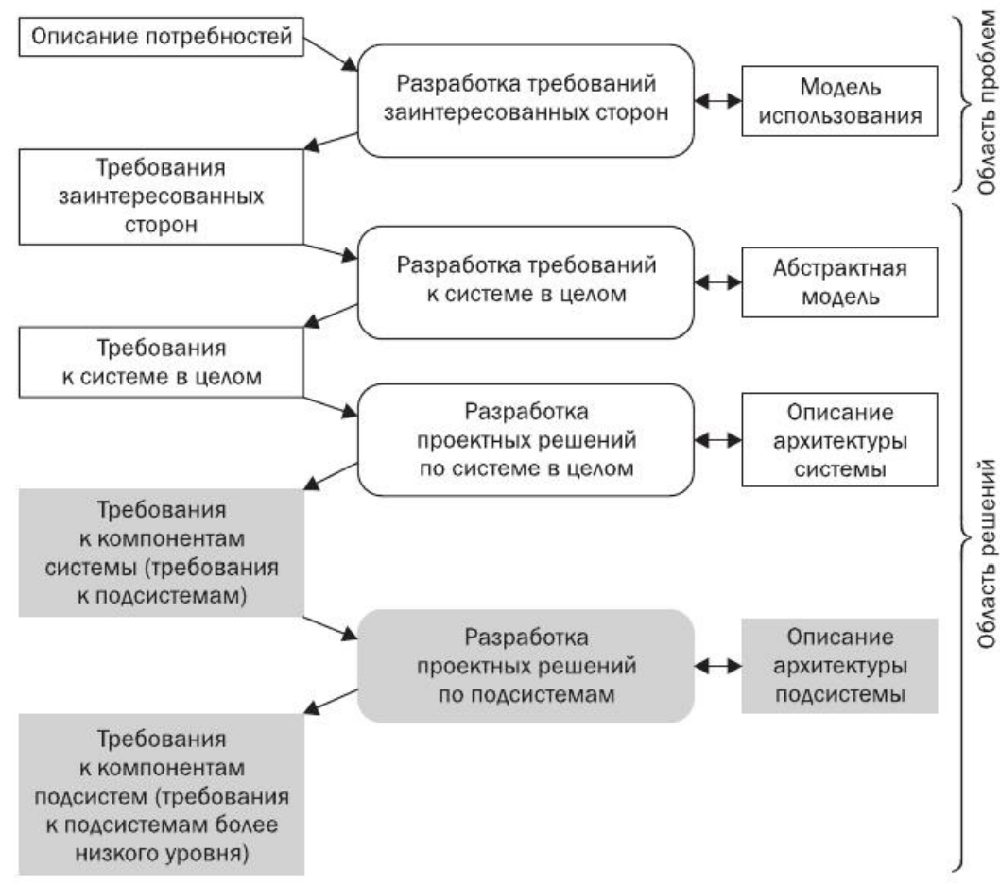
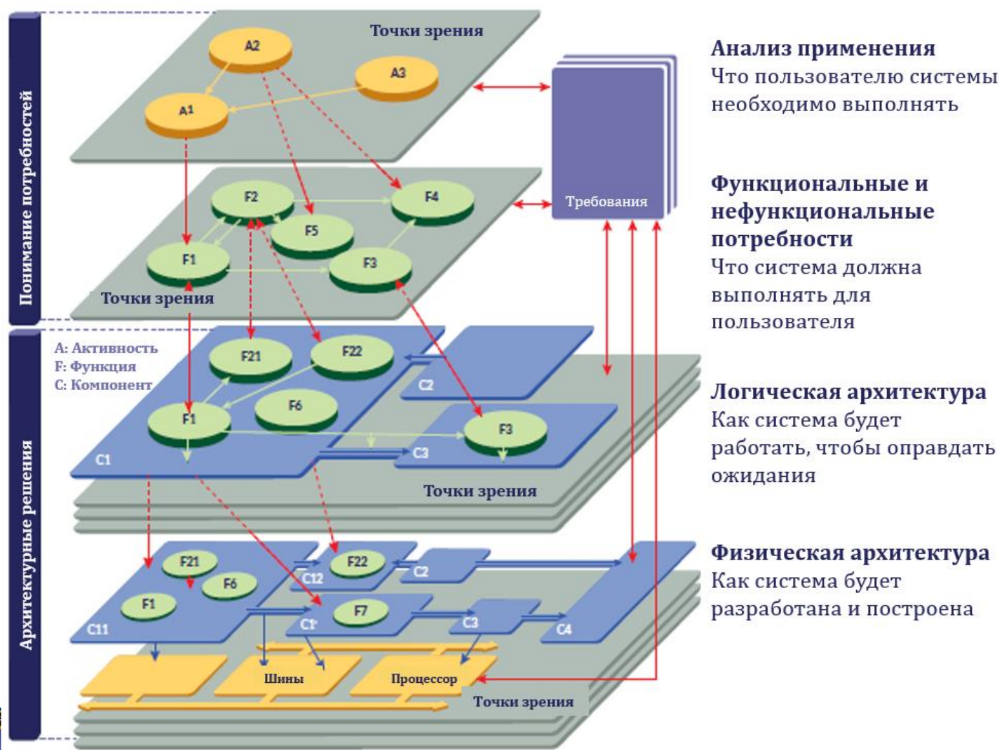
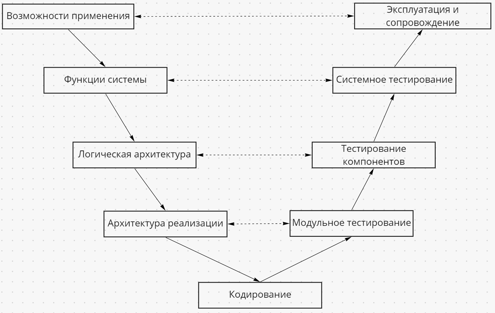
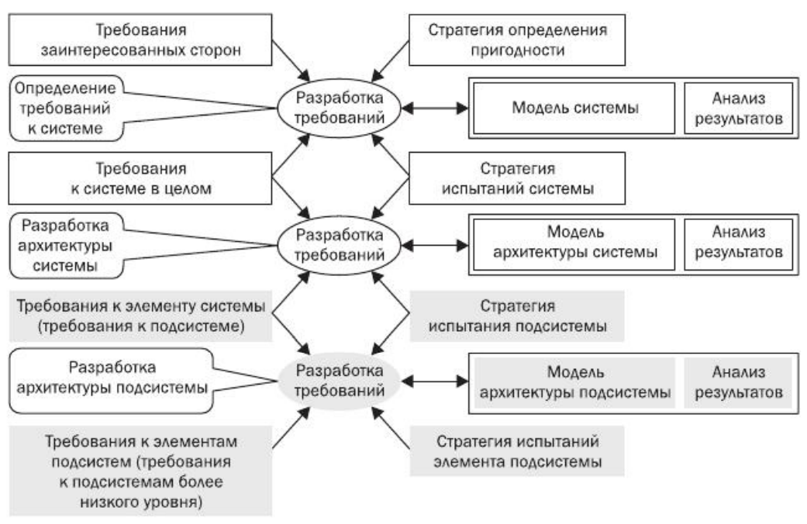
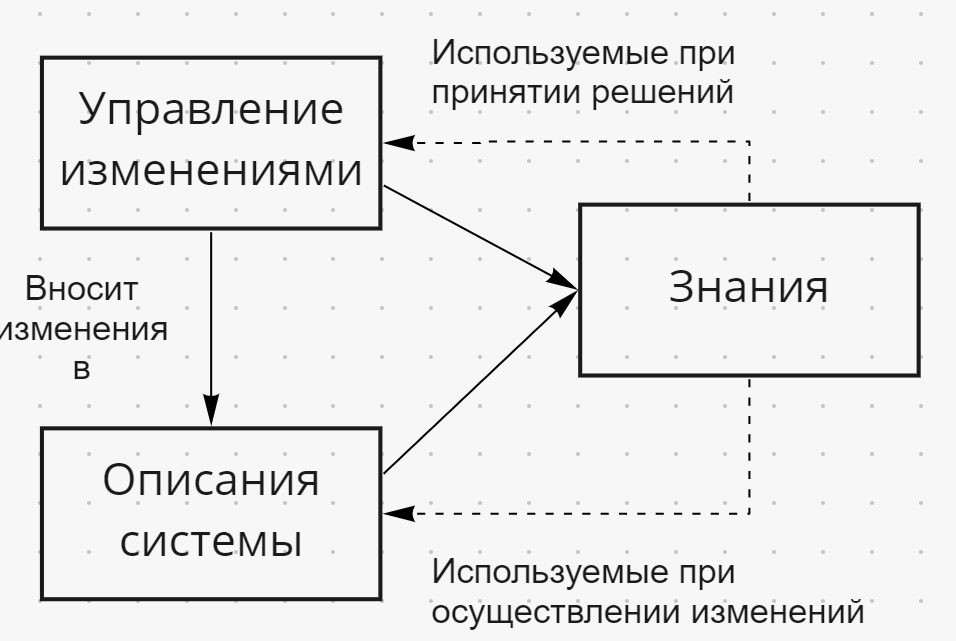

# Метод разработки

Этапы разработки позаимствованы из методологии системной инженерии Arcadia. Метод предоставляет универсальный
подход, как к физическим, так и программным системам. В рамках этого проекта можно пренебрегать многими
формальными вещами, но описанные этапы разработки остаются критически важными. В условиях отсутствия богатого
опыта в прикладной области, полагаться только на интуицию невозможно, поэтому полезной может быть каскадная
разработка. Постепенный выбор решений, архитектуры и реализации в зависимости от выбранной задачи и их подробное
описание позволит прийти к полному пониманию проекта и применимой в нём предметной области.
Каждый этап сопровождается описанием в специализированном П.О., но его применение в рамках пробного проекта
только усложнит ситуацию. Можно взять за основу структуру методологии, чтобы не потеряться во время
проектирования, опустив большую часть формальностей.

Ключевая идея методологии - итеративный спуск сверху вниз. Предполагается, что каждый этап охватывает
разрабатываемую систему целиком и только завершив и проверив уровень, возможен спуск на нижний. Это
связано с тем, что любой дополнительный элемент на уровне анализа может вызвать цепочку изменений из-за
чего придётся изменить требования к разным элементам и проделать много дополнительно работы. Если есть
полная уверенность, что все связи элемента прочно закреплены и осознаются возможные последствия,
то можно начать работать на уровне ниже, попутно доделывая верхний, чтобы ускорить работу. Переходам между
уровнями уделяется особое внимание и важно проследить и задокументировать каждую связь. При переходе не
должно появиться несвязанных и необоснованных компонентов.

Четыре описанных уровня архитектуры, естественно, не являются монолитной системой. На каждом из уровней, с
учетом их специфики, происходит декомпозиция системы на элементы и прослеживание. Архитектура проекта является
многомерной, а не плоской, поэтому стоит помнить о различиях между уровнями систем и методологии, архитектурой
рассматриваемого этапа и проекта соответственно. При переходе к нижнему уровню методологии, архитектура системы
на исходном уровне является основой структуры для нижнего, но подлежит дополнению и изменению. Каждая подсистема
на определённом этапе является элементом, которых может декомпозироваться вновь и вновь, обеспечивая всё более
детальное описание. В любом случае прослеживанию в иерархии систем уделяется особое внимание. Каждый элемент
в системе создаётся не просто для группировки, а для реализации свойства, который не может достичь каждый
из элементов по отдельности. Поэтому, без заранее определённой цели системы и требований невозможно выполнить
прослеживание, основной задачей которого является убедиться, что система достигнет своего результата и выполнена
эффективно.

Изменения структуры нижнего уровня методологии, при сохранении выполнения требований, никак не сказывается
на структуру верхнего уровня, но любое изменение выше критически скажется на всех этапах ниже.
Однако, в декомпозиции систем на рассматриваемом этапе, зависимости намного сильнее. Родительская система
не просто служит спецификацией для всех элементов ниже, а включает их, обеспечивая взаимодействие, поэтому
при внесении изменений необходимо проследить всю цепочку изменений по принципу домино вверх и вниз.
Крайне важно иметь полное понимание системы, её возможное поведение и не игнорировать системные описания.
Чем понятнее выполнено описание, тем проще отследить, что и как будет затронуто изменениями и можно понять,
как сделать возможные изменения менее болезненными, например, внеся соответствующие архитектурные решения,
например, модульные системы.

Этот метод описывается как "основанный на точке зрения", где точки зрения формализуют то,
как эти ограничения влияют на архитектуру системы. Под точкой зрения может пониматься взгляд, например, с
позиций предметной области, иной системы или позиции человека (с точки зрения процесса рендера объект
интерпретируется как ...). Набор ценностей, критических показателей, обязанностей, целей и прочих факторов,
объединённых одними обстоятельствами и ситуацией может образовывать точку зрения, поэтому их может быть произвольно
много и точки зрения необязательно привязаны к заинтересованным лицам. Каждая позиция вправе видеть выгоду от
определённых архитектурных решений, но основная сложность в том, чтобы увидеть и учесть одновременно
несколько взглядов.

## Анализ применения

Этап анализа применения фокусируется на анализе целей и задач создаваемой системы. Анализ направлен на выявление
адекватного и предполагаемого использования системы и определения результата, к которому необходимо прийти.
Как правило, здесь необходимо обозначить всех заинтересованных лиц в системе и что они хотят. Это могут быть
разработчики, пользователи, дизайнеры, заказчики и многие другие люди. Этот этап можно пропустить, только
если заранее известно, как система будет встраиваться и поставлены требования. Любую систему кто-то планирует
поддерживать и использовать, а значит и ожидают, что система будет соответствовать
их понимаю удобства и качества, которое необходимо зафиксировать. Подробно узнав, как кто-то хочет применять
систему, что полезного она принесёт, можно разработать решение, которое будет кому-то нужно, а не делать
проект в вакууме. Для самых простых задач и компонентов, применение которых не распространено, этот этап можно
провести, нигде не фиксируя, опираясь на интуицию разработчика.

Следует обратить внимание на:
- Какой эффект ожидаем, создав систему, ради чего затеяли её разработку? 
- Кто и как планирует применять полученную систему? 
- Какие ограничения накладывает существующая система? 
- Какие альтернативные варианты постановки задачи есть?

## Функциональный анализ

Этап фокусируется на том, как создаваемая система может достичь ожидаемого эффекта от применения. Стоит
определить функции (услуги), которая может выполнять система, сценарии функционирования, включая участие
заинтересованных сторон при необходимости. Нужно задуматься, какие данные, информация или ресурсы нужны
при применении системы, как они передаются в систему и трансформируются в каждой из её функций. Возможность
применение системы в целом или каждой из её функций обычно сопровождается ограничениями, исходящими от
заинтересованных сторон, такими как, безопасность, производительность, надёжность. На этом этапе необходимо
проверь выполнимость требований или желаний заинтересованных лиц и пересмотреть их в случае необходимости.
Под конец этапа рассматривается несколько возможных существующих реализаций, для дальнейшей проработки выбирается
та, которая лучше всего может выполнять необходимые функции, при разумной сложности, и закладывается базовая
архитектура системы. Желательно выбирать из наиболее надёжных и проверенных разработок, иначе потребуется
глубокий анализ и тестирование экспериментальных систем.

Следует обратить внимание на:
- Что именно должна делать система для достижения эффекта? 
- Как планируем встраивать в существующую систему? 
- Какие ограничения, состояния и режимы есть у системы? 
- Как система взаимодействует с другими системами или пользователями? 
- Какие есть сценарии использования системы? 
- Какие решения в теории могут удовлетворить требования?

## Логическая архитектура

На этом этапе четко определяется структура и поведение ожидаемого решения. Для встраивания функций, определённых
на предыдущем этапе необходимо построить одну или несколько декомпозиций системы на логические компоненты,
при этом каждая функция будет выделена одному компоненту. Процесс строительства должен учитывать известные практики
и приоритеты при проектировании архитектуры, применяемые в области решения и исходящие от точек зрения.
Чтобы разбивка компонентов была стабильной на дальнейших этапах проектирования, все основные ограничения 
(безопасность, производительность и т.д.) принимаются во внимание и сравниваются друг с другом, чтобы найти
наилучший компромисс. Не следует стараться построить свою архитектуру с нуля - без знаний, опыта и детального
анализа предметной области невозможно учесть возможные ситуации и скорее всего решение будет ненадёжным и
постоянно меняться. Основная задача на этом этапе собрать конструктор из готовых высокоуровневых архитектурных
решений и избежать возможных конфликтов при их функционировании. Кроме структуры создаваемой системы,
важно детально описать возможное поведение системы изнутри и как меняются её состояния.

Следует обратить внимание на:
- Какие готовые архитектурные решения есть, как их сравнить? 
- Как архитектура может интегрироваться с другими системами? 
- На какие компоненты и по какому принципу можно разбить систему? 
- К какому из компонентов привязана каждая из функций и как они взаимодействуют внутри компонентов? 
- Как и какими данными компоненты обмениваются?
- Какие основные логические сценарии (потоки) происходят в системе?
- Какие точки зрения есть на систему, их общие интересы и конфликты?

## Архитектура реализации (физическая архитектура)

Детальная архитектура на этом уровне определяет компоненты, которые необходимы для уровня выше.
Уровень вводит дополнительные проектные решения, рационализацию, архитектурные шаблоны, новые технические
условия и поведенческие компоненты, а также позволяет логическому видению архитектуры развиваться в соответствии
с реализацией, техническими ограничениями и выбором. В остальном используется тот же подход, основанный на
точке зрения, что и при построении логической архитектуры. Основное различие в том, что на предыдущем уровня
компоненты разбиты по принципу связанности и логической группировки, в то время как этот уровень модифицирует
предыдущий так, чтобы учесть все ограничения реализации.

# Модель жизненного цикла

Для разработки и сопровождения движка V-образная модель служит хорошим инструментом для создания системного
описания и проверки всех подсистем. Проект планируется поддерживать длительное время и, кроме получения опыта в
разработке и образовательного результата, желательно получить работающий прототип. Каждая ступень
проектирования сопровождается четким описанием панируемого результата и проверки на корректную работу.
При отсутствии четкой цели невозможно понять, почему не добились нужного эффекта, какие решения были выбраны
неверно и сложно догадаться, какая часть программы работает неправильно и нуждается в доработки.

В соответствии с каждым уровнем документации, описывается процесс тестирования на достижение желаемого эффекта.
Требования, проверяемые по ходу тестирования, всегда описываются до начала реализации, предполагая возможное
использование, что позволяет избежать незапланированных изменений. Испытания должны моделировать типовые и 
критические сценарии использования системы, чтобы не столкнуться с незапланированными трудностями.
Тестирование проверяет не только корректность кода конкретных частей кода, но и целых подсистем. Под корректностью
понимается не только отсутствие ошибок, но и другие критерии, такие как нагрузка на систему и даже сложно
измеримые вещи, подобные удобству написания кода и качества картинки. В таких случаях необходимо собрать примеры
и ожидания относительно реализации.

- Испытание системы во время эксплуатации проводится самым последним, но что именно будет тестироваться,
знать необходимо в первую очередь. Проверяется интеграция системы в приложение, контроль за функционированием
в рабочей среде в произвольных вариантах использования.
- Во время системного тестирование проверяется возможность интеграции системы с взаимодействующими системами
и проверка на достижение необходимого эффекта при их совместной работе.
- Во время тестирования компонентов выполняется проверка связей компонентов и системы в целом на соблюдения
всех требований и работы системы в изолированной среде.
- Модульное тестирование проверяет каждый компонент системы по отдельности для возможных сценариев использования.

# Системное описание

При подготовке описания в первую очередь
стоит задача сделать максимально понятно, будто бы для человека, не разрабатывающего описываемую систему.
Описанные пункты служат лишь подсказками и не являются полным и обязательным списком. В описание системы, будь то
в текстовом или графическом виде, нужно постараться вложить максимум своего полезного понимания для систематизации,
закрепления знаний и попыток взглянуть на систему через время.
Представьте, что вы хотите разобраться в архитектуре проекта и даже предметной области. Создайте такую базу
знаний, которую самому было бы комфортно читать. Выносите максимум полезного материала, ссылайтесь на источники,
но важно, чтобы вся информация была систематизирована и применима к проекту. Главное, следует, разделять
системное описание на системы, уровни проектирования, требования, описывать архитектуру, тестирование и 
принятые решения.

Документация представляет полное описание движка на каждом шагу проектирования. Описание представляет иерархию,
каждый из уровней обязательно прослеживается с дочерними и родительскими уровнями и ссылается на них, обязательно
создаётся с определённой целью и для достижения нужного эффекта.
Это позволяет понять структуру движка, охватив картину в целом, а не собирать по крупицам только на уровне кода.
Кроме этого, существует внутренняя документация для разработчиков каждой из частей движка, содержащая подробное
описание решений, причин их принятия и других полезных деталей разработки, и документация пользователя,
описывающая возможности применения, ожидаемое поведение и прочих описаний, нацеленных на прикладное и
полезное понимание системы.

Модель и архитектура системы на верхних уровнях служат описанием, с помощью которого ведётся разработка
уровня и попутно составляются требования к подсистемам, тоже являющиеся частью документации и создаются параллельно 
с основным системным описанием, потому что в них зафиксировано ожидаемое поведение компонентов, без зависимости
от конкретной реализации. Эта часть документации позволит обратиться к системе без необходимости вникать и изучать
её архитектуру, а разрабатывать и применять её, исходя из описанных возможностей. Требования
служат необходимым уровнем для перехода от одного этапа проектирования на другой, от одного уровня системы
к другому. Разработать набор связанных компонентов возможно только заранее зная, что должен делать компонент,
кроме того это позволит вести параллельную разработку нескольких компонентов в системе.

# Управление изменениями

Изменения на всех этапах жизненного цикла не редкость и, как правило, вызваны
изменениями требований или незапланированными техническими сложностями. В обоих случаях тянутся
изменения тестов, предыдущего и прошлого уровня в системе. Управлением изменениями уделяется особое внимание,
потому что это основной способ развития системы и накапливания знаний.

Внося изменение, стоит задуматься о вопросах:
- Вопрос "Почему изменение понадобилось?" поможет указать на проблему или возможность,
связанные с системой и работать не со следствиями, а источниками ситуации.
- Вопрос "Что хочу достичь изменением" необходим, чтобы оценить, насколько оправданная затея изменений
и смогла ли реализация достичь нужного эффекта
- Вопрос "Как" позволит оценить доступные ресурсы, знания и возможности и убедиться, что миссия будет выполнима

Это лишь общие наводящие вопросы, которые безусловно не являются полным списком и в зависимости от ситуации
следует оценить различные точки зрения и другие влияющие факторы. Ключевая задача - создать базу знаний и
накопить опыт, к которому позже можно будет обращаться. Документация даёт срез текущего образа системы
в текущий момент, а фиксация и управление изменениями позволит обратиться к любой части системы и понять,
почему она была добавлена и при других похожих ситуациях, возможно, стоит делать похожие вещи или, наооборот,
не делать.
