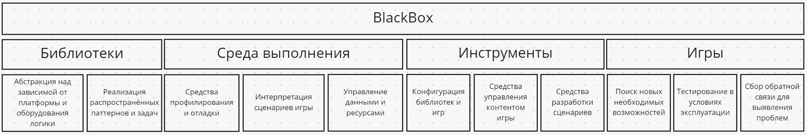

# Структура движка

Игровой движок - комплексная система, которая не может существовать в вакууме. Необходимо учитывать интересы
многих заинтересованных сторон, имеющих дело с разными частями системы. Во время жизненного цикла
проекта требуется постоянное сопровождение, тестирование и модернизация системы в связи с усиливающимися
требованиями.

# Библиотеки
Библиотеки, как правило, абстрагируют низкоуровневую логику, помогают быстро решать распространённые задачи,
не требуя погружения в узкоспециализированные области или помогают поддерживать простоту и структурированность кода
с помощью готовых реализаций распространённых паттернов.

# Среда выполнения
Каждая игра представляет отдельные, независимый проект. Основной геймплей создаётся с использованием библиотек
движка, но узкоспециализированные задачи могут не выноситься в библиотеки, а решаться на месте. В любом случае
разработчик создаёт сценарии игры, интерпретируемые или работающие только с движком, который берёт на себя контроль
всех создаваемых ресурсов и управления данными, выполняет роль посредника при взаимодействии с системой. В ходе
исполнения игры возникают сложное поведение и множество динамических взаимодействий, которые невозможно
контролировать без средств мониторинга и отладки, входящие в среду выполнения.

# Игры
В процессе разработки движка необходимо создание и поддержка различных игр, которые позволяют определить,
какие новые возможности стоит реализовывать и убедиться в работоспособности движка в условиях, близким
к обычной разработке игр. Фидбек от разработчиков игр и их профилирование помогут выявить проблемы.

# Инструменты
Кроме библиотек и игр существует промежуточный слой, помогающий связать миры разработчиков движка и игр.
Игра полностью не является внешним приложением, а интегрируется с движком, поэтому для запуска необходима
конфигурация, определяющая, какие компоненты движка следует использовать и как вызывать и обрабатывать
созданные сценарии. Богатый набор инструментов для разработки логики и наполнения игры, который обычно
пользователь называет движком, позволяют упростить использование библиотек, создавая еще один уровень автоматизации.
